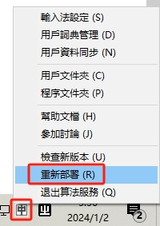

# Toki Pona with RIME

This is a repository of RIME schemas for Toki Pona.

## Install

1. Install [RIME](https://rime.im/)
2. Install the font [Nishiki-teki](https://umihotaru.work/nishiki-teki.zip)
3. Download the zipped [config files](https://github.com/dec32/Toki-Pona-Rime/archive/refs/heads/master.zip)
4. Copy all three config files:

    - `sitelen_pona.schema.yaml`
    - `sitelen_pona.dict.yaml`
    - `default.custom.yaml`

   into: `%APPDATA%/Rime`

5. Press <kbd>Win</kbd> + <kbd>Space</kbd> to switch to RIME and reload it via:

    

P.S. If you use macOS or Linux, copy the config files into:

|Platform                     |Directory                    |
|-----------------------------|-----------------------------|
|macOS                        |`~/Library/Rime`             |
|Linux (fcitx5)               |`~/.local/share/fcitx5/rime/`|
|Linux (ibus)                 |`~/.config/ibus/rime/`       |
|Linux (ibus 0.9.1 or lower)  |`~/.ibus/rime/`              |

## Customize

RIME is a highly customizable input method. Here's a very breif instruction on how to customize a couple of things.

To use a different font for the input method, edit the value of `"style/font_face"` in `sitelen_pona.custom.yaml`. Notice that the schema relies on UCSUR-compliant fonts to function. To find and install such fonts, please visit [this spreadsheet](https://docs.google.com/spreadsheets/d/1xwgTAxwgn4ZAc4DBnHte0cqta1aaxe112Wh1rv9w5Yk/htmlview?gid=1195574771).

To customize the spellings of the glyphs, go to `sitelen_pona.dict.yaml` to edit the mapping. Each glyph and its corresponding spelling are seperated by a TAB character. You can also map a sequence of glyphs to a spelling. That will create a phrase.

To customize punctuators and control characters, edit the `punctuator` section of `sitelen_pona.schema.yaml`.

Remember to reload RIME after editing the config files to deploy the customization.

## Uninstall

1. Run `C:\Program Files (x86)\Rime\weasel-{VERSION}\uninstall.exe`
2. Reboot your device
